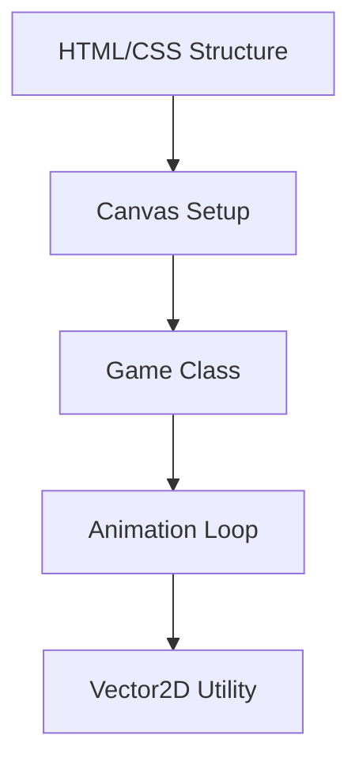
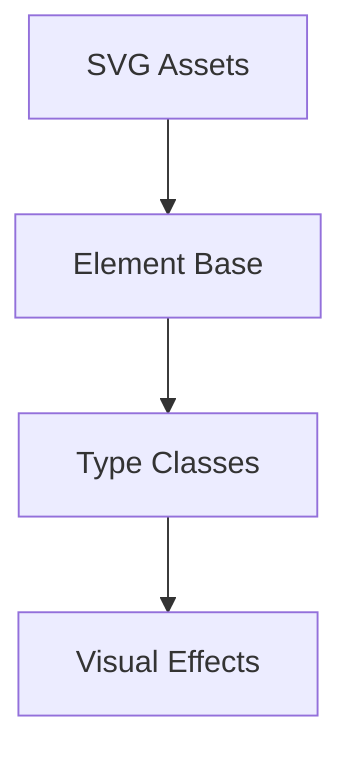
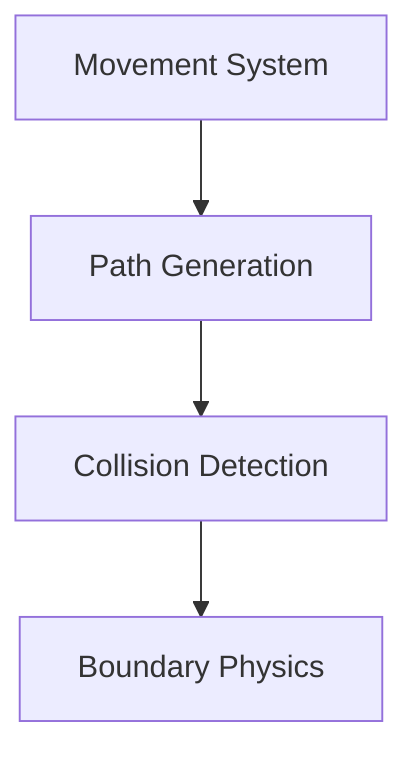
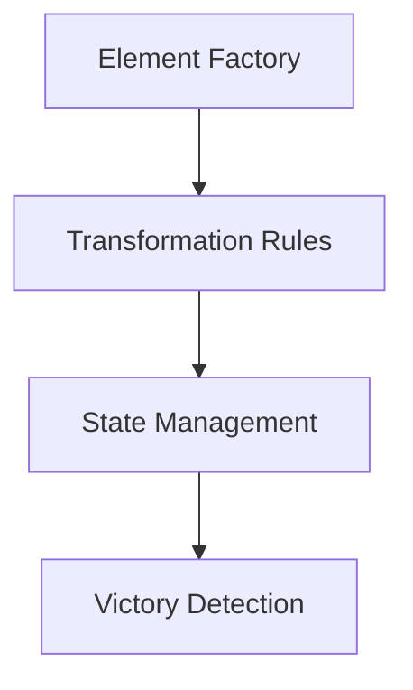
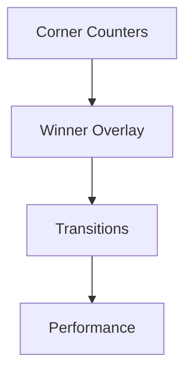

# Active Context

## Implementation Plan

### Phase 1: Project Setup and Core Structure

1. Create HTML structure with full-screen canvas
2. Add floating corner counters
3. Create winner overlay structure
4. Set up responsive canvas sizing
5. Implement basic Game class with RAF loop

### Phase 2: SVG and Visual System

1. Create SVG icons for each element type
2. Implement element rendering system
3. Add rotation during movement
4. Create glow effect shader
5. Implement morphing system

### Phase 3: Physics and Movement

1. Implement curved path generation
2. Add velocity-based movement
3. Create collision detection system
4. Add boundary collision handling
5. Implement smooth position updates

### Phase 4: Game Logic and Interactions

1. Create ElementFactory for spawning
2. Implement transformation rules
3. Add state management system
4. Create victory detection
5. Implement counter system

### Phase 5: UI and Polish

1. Add floating corner counters
2. Implement full-screen winner overlay
3. Add smooth transitions
4. Optimize performance
5. Polish visual effects

## Technical Decisions

### Visual System
- SVG-based element representations
- Smooth curved movement paths with rotation
- Morphing animations for transformations
- Subtle glow effects during interactions

### UI Layout
- Minimal floating counters in corners
- Clean, modern typography
- Full-screen overlay for winner announcement
- Smooth fade transitions

### Animation System
- RequestAnimationFrame for core loop
- CSS transitions for UI elements
- SVG morphing for transformations
- WebGL for glow effects

### Performance Optimizations
- Spatial partitioning for collisions
- GPU-accelerated animations
- Efficient path calculations
- Batched rendering updates

## Next Steps
1. Set up project structure
2. Create HTML/CSS foundation
3. Implement basic Game class
4. Begin SVG asset creation