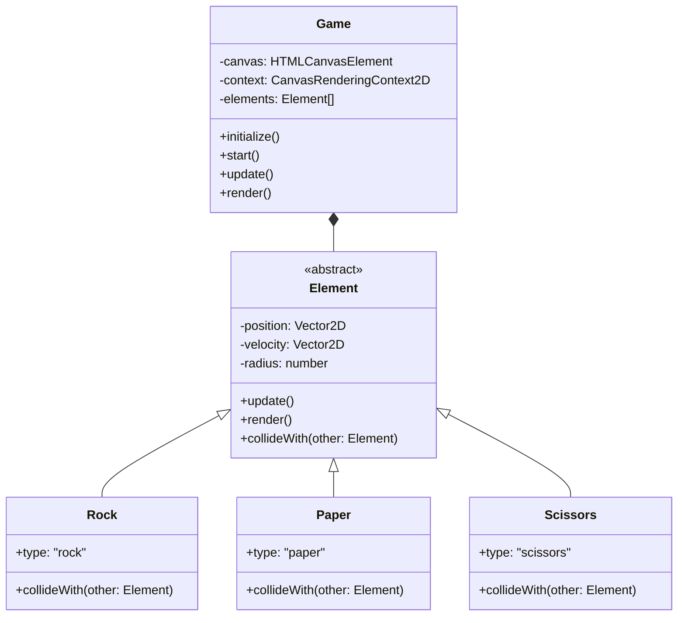
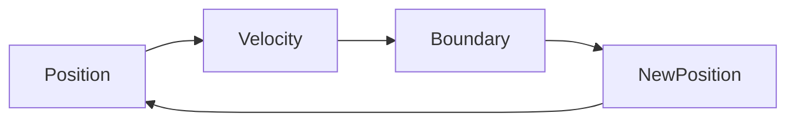
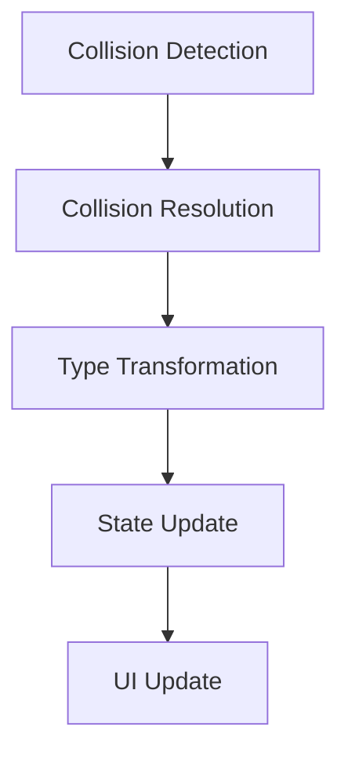

# System Patterns

## Architecture Overview



## Design Patterns

### Factory Pattern
- ElementFactory for creating Rock, Paper, Scissors instances
- Handles element type transformations during collisions

### Observer Pattern
- Game state changes notify UI updates
- Element count display updates
- Winner announcement system

### Game Loop Pattern
- RequestAnimationFrame for smooth animation
- Update and render cycle separation
- State management and collision detection

## Core Systems

### Movement System


### Collision System


### Element Interaction Rules
```mermaid
flowchart TD
    Rock -->|Crushes| Scissors
    Scissors -->|Cuts| Paper
    Paper -->|Covers| Rock